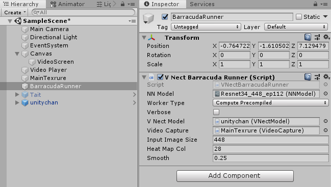
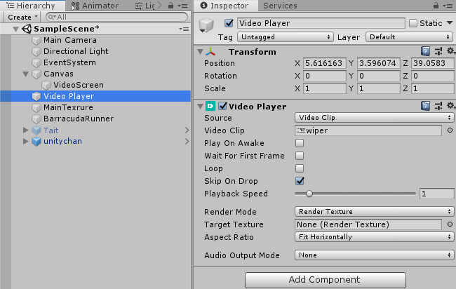

# ThreeDPoseUnityBarracuda
Unity sample of 3D pose estimation using Barracuda

# Now in preparation

## Outline
ThreeDPoseUnityBarracuda is a sample source which read the onnx by Barracuda and do threeD pose estimation on Unity.
the accuracy got better than pre model.

## Install and Tutorial
### Download and put files
1. Download/Clone the folders named as "Assets" and "Packages" into your Unity Project.

2. Replace or add those of folders downloaded in your Unity Project.

3. Download onnx from our home page by clicking following URL in our HP. 
   http://digital-standard.com/threedpose/models/Resnet34_3inputs_448x448_20200212.onnx
   
4. put the onnx under Assets/Scripts/Model/
   
### Settings in Unity Inspector
1. Open the Unity project with Unity Editor.

2. Open "SampleScene" in "Scene" folder. 
   if dialog shows up, please choose "Don't save".  
3. Set model 
   drag the onnx you put before in Assets/Scripts/Model/ 
   and drop it to "NN Model" in Gameobject named as "BarracudaRunner" in Inspector view.
   
   
4. Start Debug 
   Now you can see real time motion capture by starting Debug.
   
   
## ※Option 
・ Choose Video 
   You can choose the target video. 
   put the video you choose in Assets/Video/, and then drag the file and drop it to Video Clip of "Video Player". 
   
   
・Choose Avatar 
    There are two types of avatar in this Scene. 
    You can change the avatar easily in inspector view. 
    Firstly activate Gameobject named as "Tait" and deactivate "unitychan". 
    Secondly drag the Gameobject and drop it to "V Nect Model" of "BarracudaRunner". 
    
    
・Set size of video screen 
   The size of video screen affect the size of avatar. 
   You can set the number in "Video Background Scale" of "MainTexture". The range is 0.1 ~ 1. Default value is 1. 
   
   
・Skip On Drop 
   If "Skip On Drop" in Video Player checked, VideoPlayer is allowed to skip frames to catch up with current time. 

## License
Non-commercial use only.Please use it freely for hobbies and research. When redistributing, it would be appreciated if you could enter a credit (Digital-Standard Co., Ltd.).Please contact us if you want to use it for commercial purposes.

   
    
   
