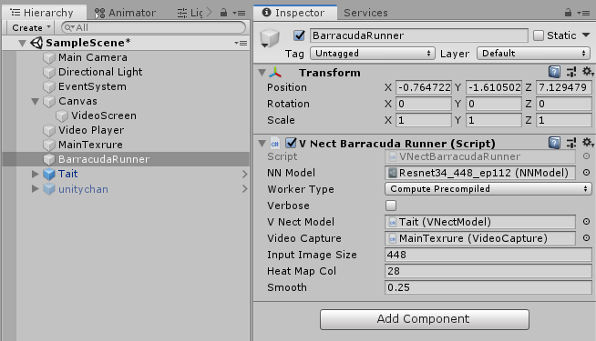

# ThreeDPoseUnityBarracuda
Unity sample of 3D pose estimation using Barracuda

## Outline
ThreeDPoseUnityBarracuda is a sample source which read the onnx by Barracuda and do threeD pose estimation on Unity.
the accuracy got better than pre model.  
*Be aware of that the target should be only one person. It does not work for multi target.   
This sample lets the avatar named as "Unity chan" behaves same as the man on real time by estimating the 3D positions on the movie. 

 
  

Created with Unity ver 2019.2.12f1. 
We use Barracuda 0.4 to load onnx. 
By updating the version to 0.5, it seems like the speed get slower.  
Now we are still trying 0.5 version.  
 
## Performance Report
### GPU  
GeForce RTX2060 SUPER ⇒ About 30 FPS  
GeForce GTX1070 ⇒ About 20 FPS  

## Install and Tutorial
### Download and put files
1. ~~Put the folders named ad "Assets" and "Packages" in your Unity Project.~~  
   Now we have added project settings to the code. So please just download/clone them to your local PC.

2. Download onnx from our home page by clicking following URL in our HP. 
   http://digital-standard.com/threedpose/models/Resnet34_3inputs_448x448_20200212.onnx
   
### Settings in Unity Inspector
1. Open the Unity project with Unity Editor and put the onnx file in /Assets/Scripts/Model/ 
   In this action, the onnx file is being converted into NNModel type of Barracuda automatically.

2. Open "SampleScene" in "Scene" folder. 
   If dialog shows up, please choose "Don't save".  
3. Set model 
   Drag the NNModel you put before in Assets/Scripts/Model/ 
   and drop it to "NN Model" in Gameobject named as "BarracudaRunner" in Inspector view.
   
   
4. Start Debug 
   Now you can see real time motion capture by starting Debug.
     
   
   But sometimes the avatar get out of the box like above screen shot. 

5. Arrange Size 
   In this case, you should arrange the number in "Video Background Scale" of "MainTexture".  
   The range is 0.1 ~ 1 and the default value is 1. 
   Here please set this 0.8. 
    
   
6. Start Debug anain 
   As you can see, the size of the avater fit the box.
    
   
   
## ※Other Option 
・ Choose Video 
   You can choose the target video. 
   Put the video you choose in Assets/Video/, and then drag the file and drop it to Video Clip of "Video Player". 
   
   
・Choose Avatar 
    There are two types of avatar in this Scene. 
    You can change the avatar easily in inspector view. 
    Firstly activate Gameobject named as "Tait" and deactivate "unitychan". 
    Secondly drag the Gameobject and drop it to "V Nect Model" of "BarracudaRunner". 
     
    
    *To determin direction of the face of avatar, a gameobject which works as nose has been added in those of avatars.
     So if you would like to adopt your original avatar, please add the nose referencing the code.
     
・Use Web Camera
   By checking "Use Web Cam", you can change the input images. 
    
   
・Skip On Drop 
   If "Skip On Drop" in Video Player checked, VideoPlayer is allowed to skip frames to catch up with current time. 
   
## Info
・Record 
If you want to record the motion, the following package might be suitable. 
https://github.com/zizai-inc/EasyMotionRecorder 

## License
・Non-commercial use only.Please use it freely for hobbies and research. When redistributing, it would be appreciated if you could enter a credit (Digital-Standard Co., Ltd.).Please contact us if you want to use it for commercial purposes. 

・The videos named as "Action_with_wiper.mp4"(
original video: https://www.youtube.com/watch?v=C9VtSRiEM7s) and "onegai_darling.mp4"(original video: https://www.youtube.com/watch?v=tmsK8985dyk) contained in this code are not copyright free.
  So you should not use those of files in other places without permission.  
  
## Contact 
If you have any questions, please feel free to contact us from following URL. 
Contact form:  https://digital-standard.com/contact/  
E-Mail: info@digital-standard.com  

   
